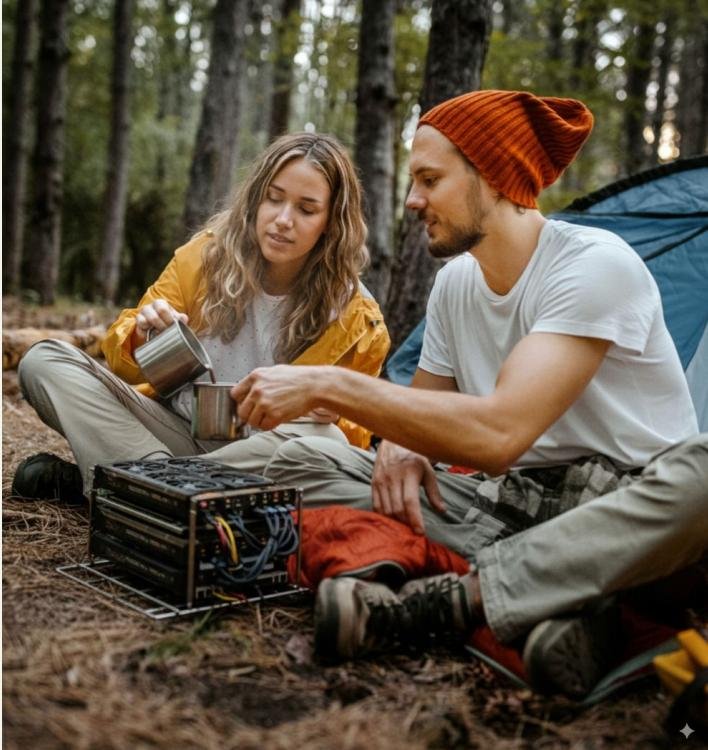
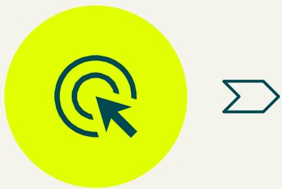

comparing   
quantization   
across hardware   
mike doan - jenny dinh

# abstract

there is a growing interest in running llms locally, either on dedicated devices like desktop / laptop gpus, or on edge devices like smartphones or in embedded environments.

this work aims to investigate the differences of quantization methods, on a multitude of devices running from android phones, to gaming laptops, and enterprise grade gpus.

however, as llms contain not only massive weights that have to be stored in (at least partially) memory, but also large activations, there have been many techniques developed to attempt to minimize this requirement. one such technique is quantization

in particular, we aim to investigate how different quantization standards and strategies impact accuracy, latency, throughput, energy, and memory usage.

# metrics

we measure following metrics across a range of devices (android phone, laptop, and desktop gpus)

# accuracy

against benchmarks, or by using raw ppl on a representative dataset like fineweb or wikitext

# latency

measured as time until first token from token submission, both including and not including tokenization and preprocessing.

# throughput

raw token/s. measured across seq lens, kvcache sizes and other inference configs.

# energy

watt/tok. measured as delta between sampled idle watt consumption and max load. also interesting is seeing how throttling impacts perf.

# memory

raw mb used. both on model load, and during peak utilization. (activations are large :( )

# core technologies

# models

• phi-3 mini (~3.8b) • qwen2.5-3b (and qwen 3) • llama-3.1-8b-instruct

# runtimes

• llama.cpp (gguf) • mlc llm (tvm-based)

# quantization strategies

• fp16 (or bf16) – reference
• int8 (w8a8)
• int4 (w4a8 / w4a4)
• kv-cache quantization (int8/int4)
• gptq/awq group-wise quant

# workloads

• prefill tokens: 256, 1024, 2048 • decode tokens: 128, 512 (batch = 1) • prompt mix: short qa, reasoning, few-shot

# extending scope

in addition to the default project goals we also would like to accomplish the following for potential lasting impact:

durable workflows

standardized data

benchmarking

enterprise gpus

there are few plug-and-play toolkits available on the market for sweeping across quantization strategies.

we would like to automate as much of the process as possible

others can use the code to benchmark their devices / find optimal quantization strategies.

we aim to use a well thought out data format, suitable for public indexing and searching.

this will make it easy for us to collate and illustrate our results, and also make it simple for others to append their devices onto a shared data bank.

in addition to measuring raw perplexity, we also aim to measure downstream performance on actual benchmarks.

for this, we will use the verifiers framework https://github.com/willccbb/verifiers, which has a library of premade, publicly maintained plug and play benchmarks.

as mentioned in previous slides, we also aim to target enterprise gpus as part of our investigation.

this is because we believe that most models, even local ones, will still have the highest return on investment when deployed on chips with proper compute / ram balancing, and this will benefit from a cohesive sweep.

# expected challenges

# software incompatibility

since we are targeting multiple backends (arm for phones, x86/cuda for desktops and laptops), we expect some software to not natively work.

# implementation inconsistencies

it is possible that different quantization standards are not implemented the same way across backends.

this will likely lead to discrepancies in measured performance.

# engineering challenges

because we are extending the scope of the project to the creation of a durable and generic benchmarking suite, we expect to face some design / implementation challenges.

# research outputs

# research writeup

we will write a detailed report of our work in standard arxiv preprint format. this will contain the fine details of our techniques, and analysis of our results.

# presentation

tba

# public codebase

we will release the code under a permissive mit license.

it will be well tested, easily reproducible, and target as many backends as we can manage.

any suggestions?

we will release the code under a permissive mit license.

it will be well tested, easily reproducible, and tarāet as many backends as we can manaāe.

tba

# timeline

week 1: sanity checks: focus on llama.cpp, get inference running on pixel phone, macbook laptop, x86 desktop on cpu and gpu.

week 2: data format definition, trivial sampling: (note: hard coded inputs for data simplicity)

week 3: end to end automation. ci backend. correct sampling: wikitext, fineweb sampling. results for llama.cpp should be collected.

week 4: mlc backend. new results.

week 5: verifiers benchmarking. work on writeup.

week 6: full sweeps, scale up. (sourcing data publicly?)

week 7: headroom for project scope.

week 8: headroom for project scope.

# thank you!
